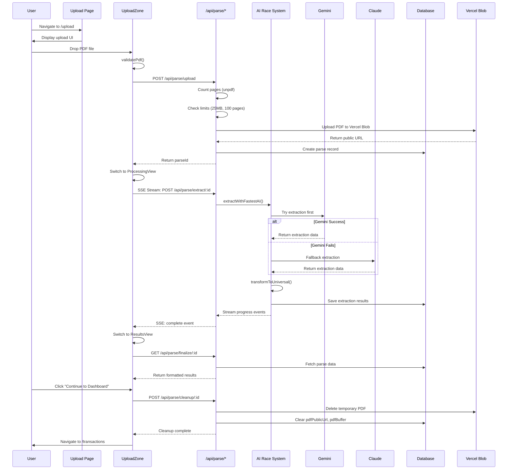

# TC Helper App - Extraction Process Documentation
**Version:** 1.0.0  
**Date:** January 29, 2026  
**Status:** Current Production Flow

---

## Table of Contents
1. [Overview](#overview)
2. [High-Level Architecture](#high-level-architecture)
3. [Visual Flow Diagrams](#visual-flow-diagrams)
4. [Detailed Process Flow](#detailed-process-flow)
5. [File Reference Guide](#file-reference-guide)
6. [Data Transformation Pipeline](#data-transformation-pipeline)
7. [Error Handling](#error-handling)
8. [Deprecated Code to Remove](#deprecated-code-to-remove)

---

## Overview

The TC Helper extraction process converts uploaded real estate contract PDFs into structured, editable transaction data. The system uses AI models (primarily Gemini, with Claude fallback) to extract key information like buyer/seller names, property details, purchase price, timeline events, and broker information.

**Key Characteristics:**
- **Direct PDF Processing**: No pre-classification required (removed in v5.0.0)
- **AI Racing**: Prefers Gemini 3 Flash, falls back to Claude Haiku if needed
- **Real-time Progress**: SSE streaming for live UI updates
- **Automatic Cleanup**: Temporary files deleted after extraction
- **Structured Timeline Data**: New v1.0.0 timeline extraction with calculation metadata

---

## High-Level Architecture

```
┌─────────────────────────────────────────────────────────────┐
│                    USER JOURNEY PHASES                       │
├─────────────────────────────────────────────────────────────┤
│                                                              │
│  1. UPLOAD    →  2. EXTRACT    →  3. RESULTS    →  4. CLEANUP │
│     (Client)      (AI Racing)       (Display)        (Auto)   │
│                                                              │
└─────────────────────────────────────────────────────────────┘

┌────────────────────┐
│   FRONTEND LAYER   │
├────────────────────┤
│ - Upload Page      │
│ - UploadZone       │
│ - ProcessingView   │
│ - ResultsView      │
└────────┬───────────┘
         │
         ↓
┌────────────────────┐
│   HOOK LAYER       │
├────────────────────┤
│ - useFileUpload    │
│ - useExtractionStream │ ← SSE Connection
│ - useCleanupEffects│
└────────┬───────────┘
         │
         ↓
┌────────────────────┐
│   API LAYER        │
├────────────────────┤
│ /api/parse/upload  │ → Vercel Blob + DB
│ /api/parse/extract │ → AI Racing System
│ /api/parse/cleanup │ → Blob Deletion
└────────┬───────────┘
         │
         ↓
┌────────────────────┐
│ EXTRACTION ENGINE  │
├────────────────────┤
│ - AI Race System   │
│ - Gemini Extract   │
│ - Claude Extract   │
│ - Transform Utils  │
└────────┬───────────┘
         │
         ↓
┌────────────────────┐
│   DATA LAYER       │
├────────────────────┤
│ - Prisma DB        │
│ - Vercel Blob      │
│ - Parse Result     │
└────────────────────┘
```

---

## Visual Flow Diagrams

### 1. Sequence Diagram - Full Extraction Flow



### 2. Flowchart - AI Racing Decision Logic

```mermaid
flowchart TD
    Start([User Uploads PDF]) --> Upload[/api/parse/upload]
    Upload --> Validate{Valid PDF?<br/>Size & Pages}
    Validate -->|No| Error[Return Error]
    Validate -->|Yes| BlobUpload[Upload to Vercel Blob]
    BlobUpload --> CreateDB[Create Parse Record]
    CreateDB --> SSE[Start SSE Stream]
    
    SSE --> AIRace[AI Race System]
    AIRace --> TryGemini[Try Gemini First]
    TryGemini --> GeminiSuccess{Success?}
    
    GeminiSuccess -->|Yes| Transform[Transform to Universal]
    GeminiSuccess -->|No| TryClaude[Fallback to Claude]
    TryClaude --> ClaudeSuccess{Success?}
    ClaudeSuccess -->|Yes| Transform
    ClaudeSuccess -->|No| AllFailed[All Providers Failed]
    
    Transform --> SaveDB[Save to Database]
    SaveDB --> StreamComplete[Stream: Complete Event]
    StreamComplete --> DisplayResults[Display Results to User]
    DisplayResults --> UserAction{User Action}
    
    UserAction -->|Continue| Cleanup[Cleanup Temp Files]
    UserAction -->|Navigate Away| Cleanup
    Cleanup --> DeleteBlob[Delete Blob Files]
    DeleteBlob --> ClearDB[Clear Temp DB Fields]
    ClearDB --> Done([Process Complete])
    
    Error --> Done
    AllFailed --> Done
```

---

## Detailed Process Flow

### PHASE 1: UPLOAD (Client → API)

**Entry Point:** `/src/app/upload/page.tsx`

#### 1.1 User Interface Initialization
```typescript
// File: src/app/upload/page.tsx
// Loads user data, checks credits/quota, renders upload UI
```

**Components Involved:**
- `UploadZone` - Main upload component with drag-and-drop
- `Dropzone` - Visual drop area with file input
- `UploadLayout` - Two-column layout with sidebar

**Key Logic:**
```typescript
// File: src/hooks/useFileUpload.ts
const validatePdf = async (file: File): Promise<boolean> => {
  // 1. Check PDF magic bytes (0x25 0x50 0x44 0x46)
  // 2. Validate size (min 10KB, max 25MB)
  // 3. Return true/false
}
```

#### 1.2 File Upload to API
```typescript
// File: src/hooks/useFileUpload.ts → uploadFile()
POST /api/parse/upload
Headers: multipart/form-data
Body: { file: File }
```

#### 1.3 Server-Side Processing
```typescript
// File: src/app/api/parse/upload/route.ts
```

**Steps:**
1. **Authentication Check**
   - Verify Clerk user ID
   - Look up user in database

2. **Quota & Credit Validation**
   ```typescript
   // Check parse limit (FREE: 1/month, BASIC: 5/month)
   // Check credits (must have ≥1)
   // Check concurrent quota (FREE: 1, BASIC: 5)
   ```

3. **PDF Validation**
   ```typescript
   // Use unpdf (Mozilla PDF.js) to count pages
   const pageCount = await countPdfPages(buffer);
   // Reject if > 100 pages
   ```

4. **Upload to Vercel Blob**
   ```typescript
   const { url } = await put(`uploads/${timestamp}-${filename}`, buffer, {
     access: "public",
     addRandomSuffix: true,
   });
   ```

5. **Database Record Creation**
   ```typescript
   await db.$transaction([
     // Deduct 1 credit
     // Increment parseCount
     // Create parse record with pdfPublicUrl, pageCount
   ]);
   ```

**Response:**
```json
{
  "success": true,
  "parseId": "clxyz...",
  "pdfPublicUrl": "https://...blob.vercel-storage.com/...",
  "pageCount": 47
}
```

---

### PHASE 2: EXTRACTION (AI Processing)

**Entry Point:** `/src/app/api/parse/extract/[parseId]/route.ts`

#### 2.1 SSE Stream Initialization
```typescript
// File: src/hooks/useExtractionStream.ts
// Establishes Server-Sent Events connection
const response = await fetch(`/api/parse/extract/${parseId}`, {
  method: "POST",
  headers: { "Content-Type": "application/json" }
});
```

**UI Updates via SSE:**
```typescript
// File: src/components/ui/upload/processing-view.tsx
// Displays real-time progress:
// "Got your document" → "Reading through your contract" → "Organizing the details"
```

#### 2.2 AI Racing System
```typescript
// File: src/lib/extraction/shared/ai-race.ts
export async function extractWithFastestAI(pdfUrl, totalPages, onProgress)
```

**Decision Logic:**
1. **Prefer Gemini** (skip availability check, attempt directly)
   ```typescript
   const geminiProvider = AI_PROVIDERS.find(p => p.name === 'Gemini');
   // Model: gemini-3-flash-preview
   ```

2. **Fallback to Claude** (if Gemini fails)
   ```typescript
   // Model: claude-haiku-4-5-20251001
   ```

#### 2.3 Gemini Extraction Process
```typescript
// File: src/lib/extraction/gemini/extractPdf.ts
```

**Steps:**
1. **Fetch PDF from Blob**
   ```typescript
   const pdfBuffer = await fetch(pdfUrl).then(r => r.arrayBuffer());
   const pdfBase64 = Buffer.from(pdfBuffer).toString('base64');
   ```

2. **Send to Gemini API**
   ```typescript
   // File: src/lib/extraction/shared/extraction-schema.ts
   // Uses shared schema (EXTRACTION_SCHEMA)
   // Prompt: getExtractionPrompt(schemaJson)
   
   const result = await model.generateContent([
     { inlineData: { data: pdfBase64, mimeType: 'application/pdf' } },
     extractionPrompt
   ]);
   ```

3. **Extract JSON from Response**
   ```typescript
   // File: src/lib/extraction/shared/extract-json.ts
   // Handles multiple wrapper formats:
   // - <json>...</json> tags
   // - ```json...``` markdown
   // - Plain JSON objects
   ```

4. **Transform to Universal Format**
   ```typescript
   // File: src/lib/extraction/shared/transform-to-universal.ts
   const finalTerms = transformToUniversal(extractedData);
   ```

#### 2.4 Data Transformation
```typescript
// File: src/lib/extraction/shared/transform-to-universal.ts
```

**Key Transformations:**
- Normalize dates (MM/DD/YYYY → YYYY-MM-DD)
- Coerce numbers (remove $, commas)
- Build timeline events structure
- Map broker details (flat → nested)

**Example Output:**
```typescript
{
  buyerNames: ["John Doe", "Jane Doe"],
  propertyAddress: "123 Main St, Los Angeles, CA 90210",
  purchasePrice: 1950000,
  effectiveDate: "2026-01-24",
  timelineDataStructured: {
    acceptance: {
      dateType: "specified",
      effectiveDate: "2026-01-24",
      specifiedDate: "2026-01-24"
    },
    initialDeposit: {
      dateType: "relative",
      relativeDays: 3,
      anchorPoint: "acceptance",
      direction: "after",
      dayType: "business"
    },
    closing: {
      dateType: "relative",
      relativeDays: 30,
      anchorPoint: "acceptance",
      direction: "after",
      dayType: "calendar"
    }
  },
  // ... other fields
}
```

#### 2.5 Database Storage
```typescript
// File: src/app/api/parse/extract/[parseId]/route.ts
await db.$transaction(async (tx) => {
  // Update parse record with extraction results
  await tx.parse.update({
    where: { id: parseId },
    data: {
      status: "COMPLETED", // or "NEEDS_REVIEW"
      buyerNames,
      propertyAddress,
      purchasePrice,
      timelineDataStructured,
      extractionDetails,
      finalizedAt: new Date()
    }
  });
  
  // Increment user usage counter
  await tx.userUsage.upsert({
    where: { userId },
    update: { parses: { increment: 1 } }
  });
});
```

#### 2.6 SSE Complete Event
```typescript
emit(controller, {
  type: "complete",
  message: "All set!",
  needsReview: false,
  confidence: 92,
  totalPages: 47,
  modelUsed: "gemini-3-flash-preview"
});
```

---

### PHASE 3: RESULTS DISPLAY

**Entry Point:** `/src/components/ui/upload/results-view.tsx`

#### 3.1 Fetch Finalized Data
```typescript
// File: src/components/ui/upload/upload-zone.tsx
const loadExtractionResults = async (parseId: string) => {
  const res = await fetch(`/api/parse/finalize/${parseId}`);
  const { data } = await res.json();
  setExtractedData(data);
};
```

#### 3.2 Display Categories
```typescript
// File: src/components/ExtractionCategories.tsx
// Two-column layout:
// LEFT: Purchase Terms (CategoryPurchaseTerms)
// RIGHT: Timeline & Parties (CategoryTimelineContingencies, CategoryRepresentingParties)
```

**Categories Shown:**
1. **Purchase Terms & Costs**
   - Buyer/Seller names
   - Property address
   - Purchase price
   - Earnest money
   - Loan type
   - Seller credits

2. **Timeline & Contingencies**
   - Acceptance date
   - Initial deposit due
   - Seller delivery of disclosures
   - Inspection contingency
   - Appraisal contingency
   - Loan contingency
   - Close of escrow

3. **Representing Parties**
   - Listing agent (name, company, email, phone)
   - Buyer's agent (name, company, email, phone)

---

### PHASE 4: CLEANUP

**Trigger:** User clicks "Continue to Dashboard" OR navigates away

#### 4.1 Cleanup Triggers
```typescript
// File: src/hooks/useCleanupEffects.ts
// Three cleanup paths:
// 1. User clicks Complete button
// 2. Component unmount (navigation)
// 3. Window unload (tab close)
```

#### 4.2 Cleanup API Call
```typescript
// File: src/app/api/parse/cleanup/[parseId]/route.ts
POST /api/parse/cleanup/:parseId
```

**Steps:**
1. **Delete Blob Files**
   ```typescript
   // Extract key from pdfPublicUrl
   const url = new URL(parse.pdfPublicUrl);
   const key = url.pathname.slice(1);
   await del(key);
   ```

2. **Clear Database Fields**
   ```typescript
   await db.parse.update({
     where: { id: parseId },
     data: {
       pdfPublicUrl: null,
       pdfBuffer: null,
       classificationCache: Prisma.DbNull,
       // Also clear legacy fields if present:
       renderZipUrl: null,
       renderZipKey: null,
       lowResZipUrl: null,
       lowResZipKey: null,
       highResZipUrl: null,
       highResZipKey: null
     }
   });
   ```

**Response:**
```json
{
  "success": true,
  "deletedFromBlob": ["pdfPublicUrl"],
  "clearedFromDB": ["pdfPublicUrl", "pdfBuffer", "classificationCache"]
}
```

---

## File Reference Guide

### Core Extraction Files (Production)

| File Path | Purpose | Version |
|-----------|---------|---------|
| `/src/app/upload/page.tsx` | Upload page entry point | 1.0.0 |
| `/src/components/ui/upload/upload-zone.tsx` | Main upload orchestration | 6.0.0 |
| `/src/hooks/useFileUpload.ts` | File validation & upload | 1.0.0 |
| `/src/hooks/useExtractionStream.ts` | SSE progress streaming | Current |
| `/src/app/api/parse/upload/route.ts` | PDF upload & validation | 2026-01-08 |
| `/src/app/api/parse/extract/[parseId]/route.ts` | AI extraction endpoint | Current |
| `/src/lib/extraction/shared/ai-race.ts` | AI racing system | 1.1.0 |
| `/src/lib/extraction/gemini/extractPdf.ts` | Gemini extraction | 2.0.0 |
| `/src/lib/extraction/Claude/extractPdf.ts` | Claude extraction | 3.0.0 |
| `/src/lib/extraction/shared/extraction-schema.ts` | Shared AI schema | 1.0.0 |
| `/src/lib/extraction/shared/transform-to-universal.ts` | Data transformation | 1.0.0 |
| `/src/lib/extraction/shared/extract-json.ts` | JSON parsing utility | 1.0.0 |
| `/src/lib/parse/map-to-parse-result.ts` | Final data mapping | 4.0.0 |
| `/src/app/api/parse/finalize/[parseId]/route.ts` | Results endpoint | 2.0.0 |
| `/src/app/api/parse/cleanup/[parseId]/route.ts` | Cleanup endpoint | 2.1.0 |

### UI Components

| File Path | Purpose |
|-----------|---------|
| `/src/components/ui/upload/dropzone.tsx` | Drop zone UI |
| `/src/components/ui/upload/processing-view.tsx` | Loading spinner |
| `/src/components/ui/upload/results-view.tsx` | Results display |
| `/src/components/ExtractionCategories.tsx` | Category wrapper |
| `/src/components/CategoryPurchaseTerms.tsx` | Purchase terms section |
| `/src/components/CategoryTimelineContingencies.tsx` | Timeline section |
| `/src/components/CategoryRepresentingParties.tsx` | Broker info section |

### Supporting Utilities

| File Path | Purpose |
|-----------|---------|
| `/src/lib/grok/type-coercion.ts` | Type coercion helpers |
| `/src/lib/date-utils.ts` | Date calculation |
| `/src/types/extraction.ts` | TypeScript types |
| `/src/types/parse-result.ts` | ParseResult type |
| `/src/types/timeline.ts` | Timeline types |

---

## Data Transformation Pipeline

### Input: AI Raw Response
```json
{
  "extracted": {
    "buyer_names": ["John Doe", "Jane Doe"],
    "property_address": { "full": "123 Main St, Los Angeles, CA 90210" },
    "purchase_price": "$1,950,000",
    "final_acceptance_date": "01/24/2026",
    "timeline_events": [
      {
        "event_key": "initialDeposit",
        "display_name": "Initial Deposit Due",
        "date_type": "relative",
        "relative_days": 3,
        "anchor_point": "acceptance",
        "direction": "after",
        "day_type": "business"
      }
    ]
  },
  "confidence": {
    "overall_confidence": 92,
    "purchase_price": 95
  }
}
```

### Transformation Steps

1. **Type Coercion** (`type-coercion.ts`)
   ```typescript
   "$1,950,000" → 1950000 (number)
   "01/24/2026" → "2026-01-24" (YYYY-MM-DD)
   ```

2. **Universal Transform** (`transform-to-universal.ts`)
   ```typescript
   // Flatten nested structures
   // Build timelineDataStructured
   // Map broker details
   ```

3. **Date Calculation** (`date-utils.ts`)
   ```typescript
   // Calculate effective dates for all timeline events
   // initialDeposit: 2026-01-24 + 3 business days = 2026-01-29
   ```

4. **Final Mapping** (`map-to-parse-result.ts`)
   ```typescript
   // Map to ParseResult type
   // Add field provenance
   // Store in database format
   ```

### Output: ParseResult
```typescript
{
  buyerNames: ["John Doe", "Jane Doe"],
  propertyAddress: "123 Main St, Los Angeles, CA 90210",
  purchasePrice: 1950000,
  effectiveDate: "2026-01-24",
  timelineDataStructured: {
    acceptance: {
      dateType: "specified",
      effectiveDate: "2026-01-24",
      specifiedDate: "2026-01-24"
    },
    initialDeposit: {
      dateType: "relative",
      effectiveDate: "2026-01-29", // CALCULATED
      relativeDays: 3,
      anchorPoint: "acceptance",
      direction: "after",
      dayType: "business"
    }
  },
  extractionDetails: {
    route: "gemini-3-flash-preview",
    fieldProvenance: [...],
    confidenceBreakdown: { purchasePrice: 95, ... }
  }
}
```

---

## Error Handling

### Common Error Points

1. **Upload Validation Failures**
   - Invalid PDF format → Return 400 with "invalid_pdf"
   - File too large (>25MB) → Return 400
   - Too many pages (>100) → Return 400

2. **Quota/Credit Failures**
   - No credits → Return 402 with "No credits remaining"
   - Parse limit reached → Return 402 with limit info
   - Concurrent quota exceeded → Return 402 with quota info

3. **AI Extraction Failures**
   - Gemini timeout → Auto-fallback to Claude
   - All providers fail → Return error via SSE stream
   - JSON parsing error → Log and return error

4. **Database Failures**
   - Transaction rollback on any error
   - Credits/parseCount only updated on success

---

## Deprecated Code to Remove

### High Priority - Safe to Remove

1. **Classification-Related Code** (Removed in v5.0.0)
   ```typescript
   // File: src/app/api/parse/classify/[parseId]/route.ts
   // ENTIRE FILE - No longer used (direct extraction now)
   
   // File: src/lib/extraction/mistral/classifyPdf.ts
   // ENTIRE FILE - Mistral OCR no longer used
   
   // File: src/lib/extraction/classify/markdown-classifier.ts
   // ENTIRE FILE - Heuristic classification deprecated
   
   // File: src/lib/extraction/classify/post-processor.ts
   // ENTIRE FILE - Post-classification logic not needed
   
   // File: src/lib/extraction/grok/textClassify.ts
   // ENTIRE FILE - Grok text classifier deprecated
   ```

2. **Dual-DPI Render System** (Replaced with direct PDF access)
   ```typescript
   // Database fields (in cleanup but never populated):
   // - renderZipUrl
   // - renderZipKey
   // - lowResZipUrl
   // - lowResZipKey
   // - highResZipUrl
   // - highResZipKey
   
   // Can remove from:
   // - prisma/schema.prisma
   // - src/app/api/parse/cleanup/[parseId]/route.ts (legacy references)
   ```

3. **Old Page Counter** (Replaced with unpdf)
   ```typescript
   // File: src/types/pdf-page-counter.d.ts
   // ENTIRE FILE - No longer using pdf-page-counter package
   ```

### Medium Priority - Review Before Removal

1. **Legacy Date Fields**
   ```typescript
   // In ParseResult type:
   // - earnestMoneyAmount (use earnestMoneyDeposit.amount)
   // - earnestMoneyHolder (use earnestMoneyDeposit.holder)
   
   // These are kept for backwards compatibility
   // Can remove after migrating all existing records
   ```

2. **Old Extraction Routes**
   ```typescript
   // File: src/forms/california/extractor.schema.json
   // Old CA-specific schema (replaced by universal schema)
   // Keep until all migrations complete
   ```

3. **Unused Hooks**
   ```typescript
   // File: src/hooks/useParseOrchestrator.ts
   // Contains old classification logic references
   // Review and simplify to only handle: Upload → Extract → Cleanup
   ```

### Low Priority - Documentation Only

1. **Migration Files** (Keep for database history)
   ```typescript
   // All files in prisma/migrations/*
   // DO NOT DELETE - Required for Prisma
   ```

2. **Type Declarations** (Keep for TypeScript)
   ```typescript
   // src/types/classification.ts
   // May have unused types but keep for reference
   ```

---

## Notes for Future Development

### ⚠️ Known Issues to Fix

1. **Cleanup Timing**
   - Current: Cleanup runs AFTER user sees results
   - Problem: User must click "Continue" to trigger cleanup
   - Proposed: Auto-cleanup after 5 minutes if user doesn't navigate

2. **SSE Connection Handling**
   - Current: No reconnection logic if stream drops
   - Proposed: Add exponential backoff retry

3. **Error Recovery**
   - Current: All AI failures surface to user
   - Proposed: Retry logic with different prompts

### 🚀 Optimization Opportunities

1. **Caching**
   - Cache extraction schemas (currently re-stringified each time)
   - Cache Gemini model initialization

2. **Parallel Processing**
   - Currently sequential: Upload → Extract
   - Could parallelize: Upload + Extract prep

3. **Monitoring**
   - Add timing logs for each phase
   - Track AI provider success rates
   - Monitor Blob storage usage

---

## Glossary

| Term | Definition |
|------|------------|
| **Parse** | A database record representing one uploaded contract |
| **SSE** | Server-Sent Events - one-way streaming from server to client |
| **AI Racing** | Testing multiple AI providers and using the fastest/best result |
| **Universal Format** | Standardized data structure regardless of AI provider |
| **Timeline Events** | Contract deadlines/milestones (e.g., inspection, closing) |
| **Field Provenance** | Metadata tracking which page each field came from |
| **Cleanup** | Deleting temporary files (PDF, buffers) after extraction |

---

**Last Updated:** January 29, 2026  
**Maintained By:** TC Helper Development Team  
**Questions?** Review the code comments in each file for implementation details.